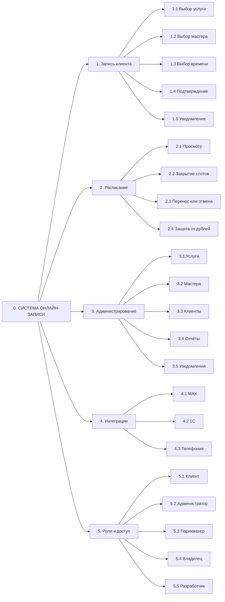

```mermaid
graph LR
    A0[0. СИСТЕМА ОНЛАЙН-ЗАПИСИ] --> A1[1. Запись клиента]
    A0 --> A2[2. Расписание]
    A0 --> A3[3. Администрирование]
    A0 --> A4[4. Интеграции]
    A0 --> A5[5. Роли и доступ]

    A1 --> A1_1[1.1 Выбор услуги]
    A1 --> A1_2[1.2 Выбор мастера]
    A1 --> A1_3[1.3 Выбор времени]
    A1 --> A1_4[1.4 Подтверждение]
    A1 --> A1_5[1.5 Уведомление]

    A2 --> A2_1[2.1 Просмотр]
    A2 --> A2_2[2.2 Закрытие слотов]
    A2 --> A2_3[2.3 Перенос или отмена]
    A2 --> A2_4[2.4 Защита от дублей]

    A3 --> A3_1[3.1 Услуги]
    A3 --> A3_2[3.2 Мастера]
    A3 --> A3_3[3.3 Клиенты]
    A3 --> A3_4[3.4 Отчёты]
    A3 --> A3_5[3.5 Уведомления]

    A4 --> A4_1[4.1 MAX]
    A4 --> A4_2[4.2 1С]
    A4 --> A4_3[4.3 Телефония]
    
    A5 --> A5_1[5.1 Клиент]
    A5 --> A5_2[5.2 Администратор]
    A5 --> A5_3[5.3 Парикмахер]
    A5 --> A5_4[5.4 Владелец]
    A5 --> A5_5[5.5 Разработчик]
```
